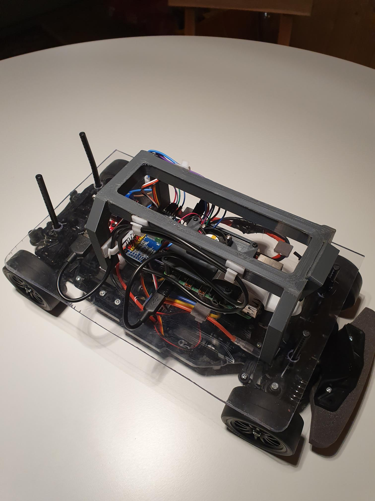

# RaspiCar

## Intro

Guide for building a small-scale prototype of an autonomous vehicle with a Raspberry Pi, OpenCV, Tensorflow and Keras.

## Project Objectives

1. Prerequisite
2. Assembly
3. Setup
4. Lane Detection
5. Traffic Sign Detection

### 1) Prerequisite

#### Hardware

1. Tamiya TT02 Chassi
2. Raspberry Pi 4
3. Camera (optional with Wide-Angle-Lense)
4. Adafruit PCA 9865
5. DC/DC Converter
6. 3D printed parts

#### Skills

1. Basic Python programming skills
2. Basic Linux operating system (cli)

### 2) Assembly

Mechanical Components:
Chassi
3D Print CAD Model
Electrical Components:
Raspi
Cam
PCA with servo and ecu (i2c)
DC/DC Converter

### 3) Setup

installation readme

### 4) Lande Detection

train_model/lane_detection

### 5) Traffic Sign Detection

train_model/object_detection
