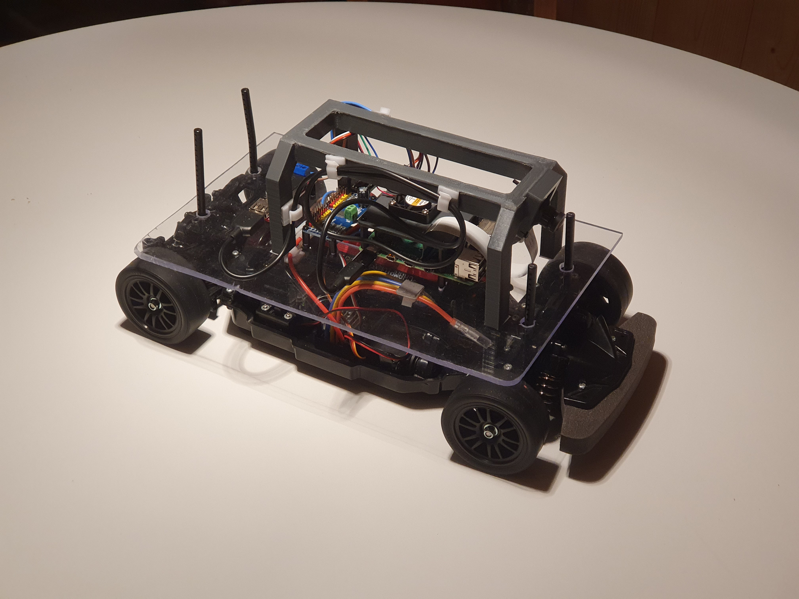
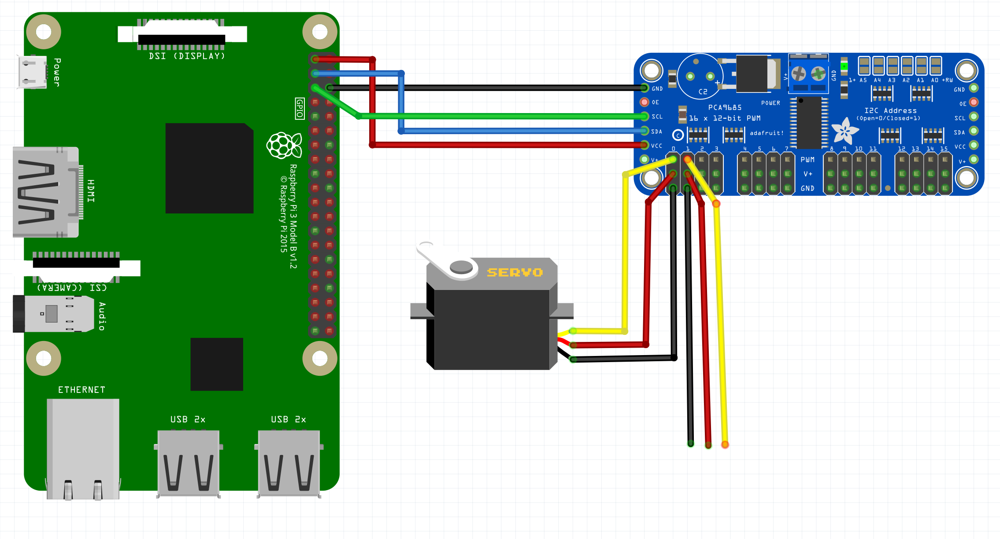
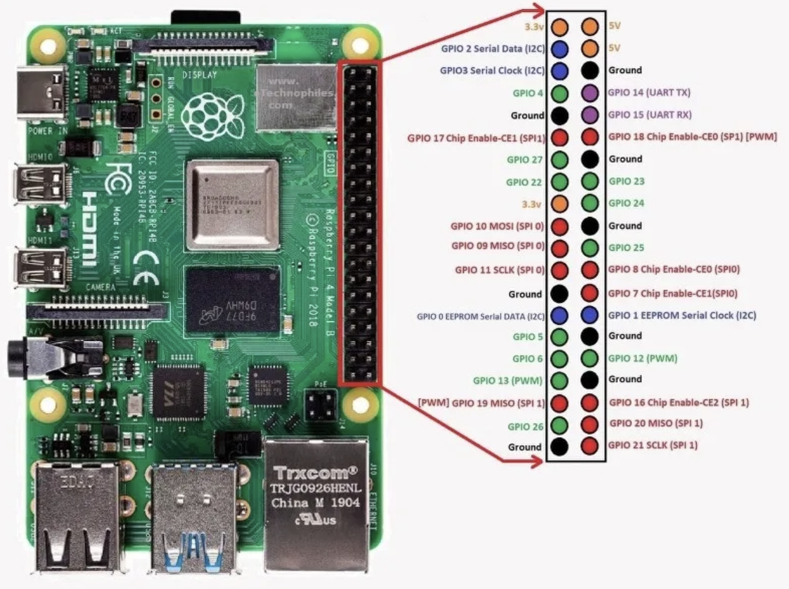

# RaspiCar

<!--  -->

## Intro

This Project is a guide for building a small-scale prototype of an autonomous vehicle. The Car will be controlled through a Raspberry Pi. 
With an Camera and the open-source python package from OpenCV the car will be able to percept with its environment. We will train a deep neural network with tensorflow and keras so the car is able to interact with its environment and steer through a small track. 

## Contents
1. [Intor](#intro)
2. [Prerequsite](#prerequisite)
3. [Assembly](#assembly)
4. [Setup](#setup)
5. [Model Training](#model-training)

### Prerequisite

#### Hardware

1. [Tamiya TT02 Chassi](https://www.amazon.de/gp/product/B01MDUQ1W6/ref=ppx_yo_dt_b_asin_title_o02_s02?ie=UTF8&psc=1)
2. [Raspberry Pi 4](https://www.amazon.de/gp/product/B07TC2BK1X/ref=ppx_yo_dt_b_asin_title_o04_s01?ie=UTF8&psc=1)
3. [PiCamera (optional with Wide-Angle-Lense)](https://www.amazon.de/gp/product/B09J8GYGQ8/ref=ppx_yo_dt_b_asin_title_o04_s00?ie=UTF8&psc=1)
4. [Adafruit PCA 9865](https://www.amazon.de/gp/product/B07BS8B637/ref=ppx_yo_dt_b_asin_title_o01_s00?ie=UTF8&psc=1)
5. [DC/DC Converter](https://www.amazon.de/gp/product/B07Q895HZ9/ref=ppx_yo_dt_b_asin_title_o09_s00?ie=UTF8&psc=1)
6. 3D printed parts

#### Skills

1. Basic Python programming skills
2. Basic Linux operating system (cli)

### Assembly

1. Mechanical Components:
  - Chassi
  - 3D Print CAD Model
2. Electrical Components:
  - Raspi
  - Cam
  - PCA with servo and ecu (i2c)
  - DC/DC Converter

Connect Electric Circuit:

### Setup

Software Dependencies:

[Raspbian Os 64-Bit](https://downloads.raspberrypi.org/raspios_arm64/images/raspios_arm64-2021-05-28/)
- Python 3.7
- Pillow 5.4.1
- Numpy 1.19.5
- Keras 2.6.0
- Tensorflow 2.6.0
- TFLite-Runtime 2.5.0
- OpenCVLite (Lightweight OpenCV Package with all needed Functions for the RaspiCar)
- Adafruit-PCA9685 1.0.1

All steps for installation is written in the installation Readme

### Model Training
If your interested in the Training Process of the Neural Networks you find the code
in the [model training](https://github.com/Fuchsi94/model-training) repository.

#### Lane Detection

[lane detection](https://github.com/Fuchsi94/model-training/tree/master/Lane-Detection)

train_model/lane_detection

#### Traffic Sign Detection

[traffic sign detection](https://github.com/Fuchsi94/model-training/tree/master/Traffic-Sign-Detection)
train_model/object_detection
