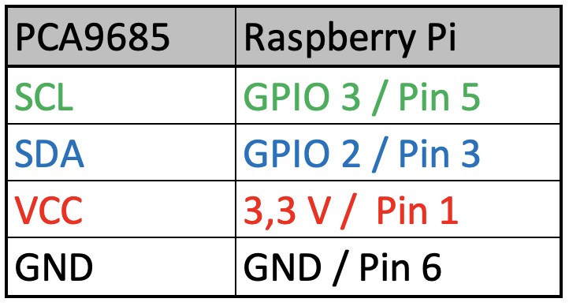

# RaspiCar

<!--  -->

## Intro

This Project is a guide for building a small-scale prototype of an autonomous vehicle. The Car will be controlled through a Raspberry Pi. 
With an Camera and the open-source python package from OpenCV the car will be able to percept with its environment. We will train a deep neural network with tensorflow and keras so the car is able to interact with its environment and steer through a small track. 

## Contents
1. [Prerequsite](#prerequisite)
2. [Assembly](#assembly)
3. [Setup](#setup)
4. [Model Training](#model-training)

### Prerequisite

#### Hardware

1. [Tamiya TT02 Chassi](https://www.amazon.de/gp/product/B01MDUQ1W6/ref=ppx_yo_dt_b_asin_title_o02_s02?ie=UTF8&psc=1)
2. [Raspberry Pi 4](https://www.amazon.de/gp/product/B07TC2BK1X/ref=ppx_yo_dt_b_asin_title_o04_s01?ie=UTF8&psc=1)
3. [PiCamera (optional with Wide-Angle-Lense)](https://www.amazon.de/gp/product/B09J8GYGQ8/ref=ppx_yo_dt_b_asin_title_o04_s00?ie=UTF8&psc=1)
4. [Adafruit PCA 9865](https://www.amazon.de/gp/product/B07BS8B637/ref=ppx_yo_dt_b_asin_title_o01_s00?ie=UTF8&psc=1)
5. [DC/DC Converter](https://www.amazon.de/gp/product/B07Q895HZ9/ref=ppx_yo_dt_b_asin_title_o09_s00?ie=UTF8&psc=1)
6. [3D printed parts](https://github.com/Fuchsi94/cad-files-raspicar)

#### Skills

1. Basic Python programming skills
2. Basic Linux operating system (cli)

### Assembly

1. Mechanical Components:
  - Chassi
  - 3D Print CAD Model
2. Electrical Components:
  - Raspberry Pi
  - Cam
  - PCA with servo and ecu (i2c)
  - DC/DC Converter

Connect Electric Circuit:

The PCA9685 module is controlled via the I2C bus (SDA and SCL).
The used Pins are specified in the Connection Table. The Circuit is connected as shown in the illustration.

### Setup

Software Dependencies:

[Raspbian Os 64-Bit](https://downloads.raspberrypi.org/raspios_arm64/images/raspios_arm64-2021-05-28/)
- Python 3.7
- Pillow 5.4.1
- Numpy 1.19.5
- Keras 2.6.0
- TensorFlow 2.6.0
- TFLite-Runtime 2.5.0
- OpenCV / OpenCVLite
- Adafruit-PCA9685 1.0.1

### Model Training
Each training script can be found in the [model training](https://github.com/Fuchsi94/model-training) repository.

#### Lane Detection

Behavioural Cloning concept

[Lane Dataset](https://github.com/Fuchsi94/lane-training-data)

[lane detection](https://github.com/Fuchsi94/model-training/tree/master/Lane-Detection)

#### Traffic Sign Detection

[Traffic-Sign-Classification]()

TensorFlow Object Detection

[Traffic Sign Dataset](https://github.com/Fuchsi94/traffic-sign-training-data)

[traffic sign detection](https://github.com/Fuchsi94/model-training/tree/master/Traffic-Sign-Detection)

